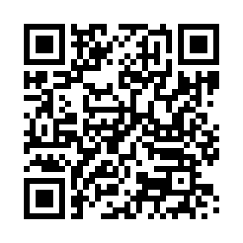

# Uni App Security Exercises

## Introduction

### Contributing

These study materials are heavily based on [professor Heuzeroth's "Anwendungssicherheit" lecture at HdM Stuttgart](https://www.hdm-stuttgart.de/studierende/abteilungen/sprachenzentrum/kursangebot/kursangebot/block?sgname=Medieninformatik+%28Bachelor%2C+7+Semester%29&blockname=Anwendungssicherheit&sgblockID=2573375&sgang=550033).

**Found an error or have a suggestion?** Please open an issue on GitHub ([github.com/pojntfx/uni-appsecurity-notes](https://github.com/pojntfx/uni-appsecurity-notes)):

{ width=150px }

If you like the study materials, a GitHub star is always appreciated :)

### License

<!-- { width=128px } -->

Uni App Security Exercises (c) 2022 Felicitas Pojtinger and contributors

SPDX-License-Identifier: AGPL-3.0
\newpage

### Results

#### Übung 1

**Was ist sichere Software?**

- Software, welche gegen bewusst durchgeführte Angriffe geschützt ist
- Software, welche gegen bekannte und unbekannte Angriffe abgesichert ist

**Wodurch ist der Begriff der Informationssicherheit (engl. security) charakterisiert? Nennen Sie dazu auch die drei grundlegenden Sicherheitskriterien sowie mindestens zwei weitere.**

- Security hat zentral den Begriff Risiko
- Ein gewisses, kontextabhängiges Risiko wird akzeptiert (i.e. in Kernkraftwerken wird ein sehr geringes Risiko akzeptiert)
- Sicherheitskriterien:
  - Confidentiality
  - Integrity
  - Availability
  - Non-Repudiation
  - Privacy
- Es gibt zwischen den Sicherheitskriterien fast immer Spannungen (i.e. Non-Repudiation vs. Privacy)
- "A system is protected against threats compromising valuable data using measures which lead to a reduced, accepted risk."

**Wodurch unterscheidet sich dieser Begriff (security) von der Funktionssicherheit (engl. safety)?**

- Security ist der Schutz eines Systems vor der Umgebung, Safety ist der Schutz der Umgebung vor einem System

**Warum muss man sich überhaupt mit IT- und Informationssicherheit beschäftigen?**

- Typischerweise ~30 Fehler pro 1000 Zeilen Code
- Anwendungen werden zunehmend komplexer
- Geräte (i.e. IoT) werden immer mehr verbunden ("Das S in IoT steht für Security!")
- Gewisse Architekturen (i.e. Erweiterung des Systems zur Laufzeit) stellen neue Risiken dar

**Was ist der Unterschied zwischen einem Exploit und einem Proof-of-Concept (PoC)?**

- Proof-of-Concept: Ein Konzept eines Exploits, welches z.B. der Demonstration einer Schwachstelle dient - ohne Schaden anzurichten
- Exploit: I.e. Software, welche bewusst eine Schwachstelle ausnutzt
- Temporal Score Metrics/Exploit Code Maturity bewertet z.B. einen Proof-of-Concept geringer als einen funktionieren Exploit

**Nennen Sie drei Beispiele für „Threat Agents“.**

- Virus
- Hacker
- Nutzer

**Wo können Sie sich über aktuelle Bedrohungen informieren?**

- MITRE CVE
- Google Project Zero
- OWASP Top 10

**Welches Vorgehen empfiehlt sich zur Entwicklung sicherer Software?**

- Während der Entwicklung MITRE CWE beachten (i.e. Input-Validation usw.)
- Entwicklungsprozess absichern (supply chain security)
- Security-Reviews durchführen
- Pentests durchführen
- Geld und Zeit in mehrere Bereiche je nach Risko investieren, nicht nur auf einen einzigen Bereich fokusieren
